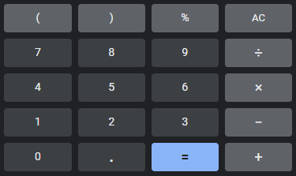

# Challenges: Functions
Try to complete these challenges to practice using functions. These challenges are a mix of difficulty, so feel free to hop around to different ones.

## Function Tests
[Click here to access the **Function Tests** challenge.](FunctionTests.md)

## Go to Google
Create a new project. Add a button with text "Go to Google" to the **index.html** page that, when clicked, will:

- Display a message saying "Going to Google..."
- Redirect the browser to Google

>Hint: there are a couple different ways to do this. It is possible to do it without using any new concepts!

## Button-based Calculator
>Note: this is different than the Calculator guided activity.

Create a button-based calculator that can perform addition, subtraction, division, and multiplication. It should end up looking something like this:

### Buttons
The HTML for the calculator should consist of many buttons:

- One button for each numeric digit (0-9)
- One button for open and close parenthesis: `(` and `)`
- One button for each basic math operator: `+`, `-`, `/`, and `*`
- One button to perform the final calculation: `=`

### Functionality
Each of the buttons should have a different functionality.

#### Character Buttons
When any button other than the `=` button is clicked, the program should add that character to the running equation. Additionally, the program should display the current equation. For example, if the "2" button is pressed, the program should display "2". Then, if the "+" button is pressed, the program should display "2+". Then, if the "1" button is pressed, the program should display "2+1".

#### Equals Button
When the `=` button is pressed, the program should:

- Display the result of the equation
    - E.g., if the equation is "2+1", display "3"
- Clear the current equation

### Resources
The [`eval`](https://developer.mozilla.org/en-US/docs/Web/JavaScript/Reference/Global_Objects/eval) function can make this challenge _much_ easier.

## 🔷 Further Reading
For a more robust introduction to functions, read through some [JAVASCRIPT.INFO](https://javascript.info/) articles:

- [Basics of Functions](https://javascript.info/function-basics)
- [Function Expressions](https://javascript.info/function-expressions)
- [Arrow Functions](https://javascript.info/arrow-functions-basics)

## Event Handling
[Click here to access the Event Handling challenges.](EventHandling.md)

## Scheduling
Read through [this guide](https://javascript.info/settimeout-setinterval), and complete the tasks at the bottom.
